# LG SOME/IP Software Design Overview
---
## Architecture

#### Purpose
This document specifies the software detailed design for LG SOME/IP (Service Discovery and the SOME/IP daemon), including the static design, dynamic design, and algorithm design.

#### Specification Basis
This implementation follows the [Open SOME/IP Specification, Version 25-12](https://github.com/some-ip-com/open-someip-spec/).
The specification and its licensing terms are published by the SOME/IP Working
Group. The specification is referenced by this project but is not bundled with
it.

#### Introduction
This document describes the design of the LG SOME/IP protocol library and daemon. It covers the architecture of the library and the daemon, the class model of each module, and sequence diagrams for the main runtime scenarios (initialization, service discovery, subscription, request/response, and event notification).

#### Context Diagram
SOME/IP is a service-oriented communication protocol. The LG SOME/IP stack can be used directly by an application or through a compatible service-binding layer.

Both the library and the daemon read their service/application configuration from the file system (JSON, parsed with RapidJSON).

#### Namespaces
The implementation is organized into the following namespaces:

|Namespace|Scope|
|:---|:---|
|`lgsomeip`|Internal core SOME/IP stack: runtime, configuration, message model, packet router, endpoints, exceptions, and utilities.|
|`lgsomeip::osabstraction`|Internal OS abstraction: sockets, addresses, multiplexer, message passing, timers, and logging.|
|`vsomeip`|Supported public compatibility interface for applications and adaptation middleware.|
|`vsomeip::e2e`, `vsomeip::e2exf`|Bundled E2E implementation namespaces; their headers remain internal and are not installed as public APIs.|

The source public header boundary is `third_party/vsomeip_interface/include/vsomeip` and
is installed as `include/vsomeip`. Consumers should use the generated `vsomeip`
CMake package and must not depend directly on internal `lgsomeip::*`, serializer,
or E2E headers.

#### Process Model
The stack is split into two cooperating roles that share the same endpoint, socket, and message primitives:

* The **daemon process** (`someip-daemon`) runs a single `ServiceManager`, which owns a `PacketRouterHost`. It performs Service Discovery and routes SOME/IP traffic between local applications and remote ECUs.
* Each **application process** links the library and drives an `ApplicationManager`, which owns a `PacketRouterProxy`. The proxy connects to the daemon over local IPC (Unix domain sockets on Linux, message passing on QNX).

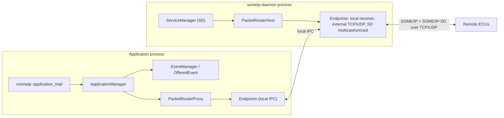

#### Architecture
##### Static View

* **Component Diagram**
    ```plantuml
    @startuml
        skinparam defaultTextAlignment center
        top to bottom direction

        skinparam rectangle {
            defaultTextAlignment center
            roundCorner 30
        }

        rectangle "LG SOME/IP" as LGSOMEIP {
            Component "VSOMEIP_Interface" as VSOMEIP {
                rectangle "Runtime" as RT
                rectangle "Application" as APP
                rectangle "Message" as MSG

                RT -[hidden]l- APP
                RT -[hidden]l- APP
                APP -[hidden]l- MSG
            }
            Component "SOME/IP Core" as SOMEIP_CORE {
                rectangle "ApplicationManager" as AM
                rectangle "ServiceManager" as SM
                rectangle "Message" as MS
                rectangle "Configuration" as CF
                rectangle "PacketRouter" as PKRT
                rectangle "Endpoint" as EP

                AM -[hidden]l- SM
                SM -[hidden]l- MS
                MS -[hidden]l- CF
                CF -[hidden]- PKRT
                EP -[hidden]u- PKRT
            }
            Component "OSAbstraction" as OSAbs {
                rectangle "multiplex" as MUL
                rectangle "socket" as SCK
                rectangle "log" as LOG

                MUL -[hidden]l- SCK
                SCK -[hidden]l- LOG
            }
            Component "E2E_Protection" as e2e {
                rectangle "buffer" as BUF
                rectangle "crc" as CRC
                rectangle "e2e" as E2E
                rectangle "e2exf" as e2exf

                BUF -[hidden]l- CRC
                CRC -[hidden]l- E2E
                E2E -[hidden]l- e2exf

            }
        }
        SOMEIP_CORE -[hidden]u- e2e
        SOMEIP_CORE -[hidden]u- VSOMEIP
        SOMEIP_CORE --[hidden]d-- OSAbs

    @enduml
    ```

    The figure above shows the component and package diagram of the LG SOME/IP solution. It consists of an `OSAbstraction` component built on the POSIX socket API and a `SOME/IP Core` component that implements the SOME/IP protocol. To provide compatibility with the open-source vSomeip binding, it also contains a vSomeip interface wrapper component, and an `E2E_Protection` component (BMW AG, MPL-2.0) for end-to-end payload protection.

    |Component|Package|Description|
    |:---|:---|:---|
    |OSAbstraction|socket|Contains the `NetworkDevice` singleton (device name / address / id) and the `Socket`/`Address` hierarchy used for TCP, UDP, and Unix-domain communication.|
    |OSAbstraction|multiplex|The `Multiplexer` delivers I/O and connection events for event-driven I/O. It has two back-ends selected at build time: `epoll` on Linux and `select` on QNX.|
    |OSAbstraction|messagepassing|QNX-only IPC transport (`MessagePassingServer`/`MessagePassingSender` and listener interfaces) used instead of Unix-domain sockets.|
    |OSAbstraction|utils|Logging (`logger`, `formatLog`) and `TimerManager`.|
    |SOME/IP Core|runtime|`ApplicationManager` (application-side facade), `ServiceManager` (daemon-side SD), and `EventManager`/`OfferedEvent` (event notification).|
    |SOME/IP Core|config|`Configuration` and the owned `ServiceInfo`, `ConfigEvent`, `ConfigEventgroup`, `ConfigurationSD`, and `ConfigE2E` objects, parsed from JSON.|
    |SOME/IP Core|message|Implements SOME/IP and SOME/IP-SD packets as byte arrays (`MessageHeader`, `MessageSOMEIP`, `MessageSD`, `MessagePayload`, `SDEntry`, `SDOption`) and (de)serialization (`MessageBuilder`, `MessageComposer`, `Serializer`).|
    |SOME/IP Core|packetrouter|Routes SOME/IP and SOME/IP-SD packets to their destination. `PacketRouterHost` runs in the daemon; `PacketRouterProxy` runs in the application. Includes optional `PacketFiltering`.|
    |SOME/IP Core|endpoint|`EndpointBase` plus the `EndpointTCPClient`/`EndpointTCPServer`/`EndpointUDP` templates (and QNX message-passing endpoints) provide unified I/O over `Socket` and `Multiplexer`.|
    |SOME/IP Core|exception|`SOMEIPException` base class and the derived error types.|
    |SOME/IP Core|daemon|`someip-daemon` entry point that hosts the `ServiceManager`.|
    |SOME/IP Core|utils|`ThreadPool`, `TimerMux`, byte-order helpers, and `SomeipPacketStatistics`.|
    |VSOMEIP interface|runtime|Static factory (`runtime`/`runtime_impl`) used by the vSomeip binding to create application, message, and payload instances.|
    |VSOMEIP interface|application/message/payload|`application_impl`, `message_impl`, and `payload_impl` wrap the core `ApplicationManager` and `Message` types behind the vSomeip API.|
    |E2E_Protection|buffer/crc/e2e/e2exf|End-to-end protection: CRC calculation, Profile 01 / custom profile checker and protector, and the `e2exf` configuration types.|

The package labels used in the diagrams (`runtime`, `packetrouter`, `endpoint`, `Socket`, and `Multiplexer`) group source modules; they do not introduce C++ namespaces beyond those listed above.


* **Class Diagram**

    * **Daemon (ServiceManager & PacketRouterHost)**

    ```plantuml
    @startuml
    skinparam defaultTextAlignment center
    top to bottom direction
    left to right direction
    hide empty members

    rectangle Daemon {
        together {
            class AvailableService <<struct>>
            class RequestedService <<struct>>
            class RequestedSubscribe <<struct>>
        }
        class SubscribeState<<Enumeration>>

        ServiceManager *-right- AvailableService
        ServiceManager *-right- RequestedService
        ServiceManager *-down- PacketRouterHost
        ServiceManager *-- Configuration
        ServiceManager *-- TimerMux

        AvailableService -[hidden]d- RequestedService
        AvailableService *-down- RequestedSubscribe
        RequestedSubscribe --> SubscribeState

        together {
            class RoutingServiceInfo <<struct>>
            class RoutingRequestPacket <<struct>>
            class RoutingApplicationInfo <<struct>>
            class RoutingConnectionInfo <<struct>>
            class RoutingSubscribeInfo <<struct>>
            class EndpointBase
        }

        rectangle MessageModule {
            together {
                class MessageBuilder
                class MessageSD
                class MessageSOMEIP
            }
            MessageBuilder -[hidden]r- MessageSD
            MessageSD -[hidden]r- MessageSOMEIP
        }

        PacketRouterHost *--right-- RoutingServiceInfo
        PacketRouterHost *--right-- RoutingRequestPacket
        PacketRouterHost *--right-- RoutingConnectionInfo
        PacketRouterHost *--right-- RoutingApplicationInfo
        PacketRouterHost *--right-- EndpointBase

        RoutingServiceInfo -[hidden]d- RoutingRequestPacket
        RoutingRequestPacket -[hidden]d- RoutingApplicationInfo
        RoutingApplicationInfo -[hidden]d- RoutingConnectionInfo
        RoutingConnectionInfo -[hidden]d- EndpointBase

        RoutingServiceInfo *-down-- RoutingSubscribeInfo
        EndpointBase -- Multiplexer
        PacketRouterHost <--> Multiplexer

        ServiceManager ...> MessageModule : <<use>>
        PacketRouterHost ...> MessageModule : <<use>>
    }
    @enduml
    ```

    The daemon process runs a single `ServiceManager`. It owns the `PacketRouterHost`, the `Configuration`, and a `TimerMux` used to drive the cyclic Service Discovery timers. `ServiceManager` keeps the discovery state in `AvailableService` and `RequestedService` records; each `AvailableService` holds a map of event groups to `RequestedSubscribe` entries, whose lifecycle is tracked by the `SubscribeState` enumeration (`SUBSCRIBED`, `UPDATE`, `UNSUBSCRIBED`). The `PacketRouterHost` owns the runtime routing tables (`RoutingServiceInfo`, `RoutingApplicationInfo`, `RoutingConnectionInfo`, `RoutingRequestPacket`, and the nested `RoutingSubscribeInfo`), the `Multiplexer`, and the endpoints.

    * **Application (ApplicationManager, EventManager & PacketRouterProxy)**

    ```plantuml
    @startuml
    skinparam classAttributeIconSize 0
    hide empty members
    top to bottom direction

    rectangle Application {
        class ApplicationManager
        class PacketRouterProxy
        class EventManager
        class OfferedEvent
        class Configuration
        class ThreadPool
        class EventStrategy<<Enumeration>>

        ApplicationManager *-down- PacketRouterProxy
        ApplicationManager *-down- EventManager
        ApplicationManager *-down- Configuration
        ApplicationManager *-down- ThreadPool
        EventManager *-right- OfferedEvent
        OfferedEvent --> EventStrategy
        PacketRouterProxy --> Multiplexer
    }
    @enduml
    ```

    In an application process, `ApplicationManager` is the central facade. It owns a `PacketRouterProxy` (the connection to the daemon), an `EventManager` that manages the offered events, a `Configuration`, and a `ThreadPool` (`LGSOMEIP_NUM_OF_THREADS = 5`) used to dispatch handler callbacks. Each offered event is an `OfferedEvent` whose transmission mode is selected by the `EventStrategy` enumeration (`CyclicUpdate`, `UpdateOnChange`, `EpsilonChange`).

    * **OSAbstraction**

    ```plantuml
    @startuml
    skinparam classAttributeIconSize 0
    hide empty members
    rectangle {
        rectangle OSAbstraction {
            class Socket
            class Address
            class IP6Address
            class IP4Address
            class LocalAddress
            class AddressType<<enum>> #LightSkyBlue{
                None = 0
                UnixDomain = 1
                IPv4 = 4
                IPv6 = 6
            }
            class TCPSocket
            class TCPClientSocket
            class TCPServerSocket
            class UDPSocket

            class NetworkDevice

            Socket -right--> Address
            Address <|-down- IP4Address
            Address <|-down- IP6Address
            Address <|-down- LocalAddress
            Address ..right..> AddressType : <<use>>

            Socket <|-down- TCPSocket
            Socket <|-down- UDPSocket
            TCPSocket <|-down- TCPClientSocket
            TCPSocket <|-down- TCPServerSocket

            IP6Address ....down..> NetworkDevice
            UDPSocket ..down..> NetworkDevice

        }
        rectangle endPoint {
            class EndpointBase <<enable_shared_from_this>>
        }

        rectangle packetrouter {
            class PacketRouterHost
        }

        Address <-left- EndpointBase
        Address -left-* PacketRouterHost
        EndpointBase -up-* PacketRouterHost
        PacketRouterHost ..down..> NetworkDevice
    }
    @enduml
    ```

    The socket hierarchy is `Socket` → `TCPSocket` → { `TCPClientSocket` (adds `connect()`), `TCPServerSocket` (adds `listen()`/`accept()`) }, and `Socket` → `UDPSocket` (adds multicast join/leave/TTL). `Address` is specialized by `IP4Address`, `IP6Address`, and `LocalAddress` (Unix-domain), and the concrete type is discriminated by the `AddressType` enum. `NetworkDevice` is a singleton that resolves the IP-based device name/id used by the router. When built with the `ENABLE_TLS` option, each `SecureConfig` passed into a `Socket` enables TLS/DTLS via the OpenSSL-backed `SecureConnector`.

    * **Multiplexer**

    ```plantuml
    @startuml
    skinparam classAttributeIconSize 0
    hide empty members

    rectangle Multiplexer{
        class PacketRouterHost
        class Endpoint <<alias>>
        class PacketRouterProxy

        rectangle osabstraction{
            class Multiplexer
        }

        PacketRouterHost *-Down- Multiplexer
        Endpoint -Down-> Multiplexer
        Endpoint -left-* PacketRouterHost
        Endpoint -right-* PacketRouterProxy
        PacketRouterProxy *-Down- Multiplexer
    }
    @enduml
    ```

    * **Endpoint**

    ```plantuml
    @startuml
    skinparam classAttributeIconSize 0
    hide empty members
    left to right direction
    rectangle {
        rectangle endpoint {
        class EndpointUtils
        class EndpointBase
        class EndpointTCPClient<BASETYPE::typename>
        class EndpointTCPServer<BASETYPE::typename>
        class EndpointUDP<BASETYPE::typename>

        EndpointUtils .down.> EndpointBase : <<create>>
        EndpointBase <|-down- EndpointTCPClient
        EndpointBase <|-down- EndpointTCPServer
        EndpointBase <|-down- EndpointUDP
        }

        rectangle osabstraction {
            class Socket::Socket
            class Multiplexer::Multiplexer
            class Socket::Address

            Socket::Socket -[hidden]- Multiplexer::Multiplexer
            Multiplexer::Multiplexer -[hidden]- Socket::Address

        }
        EndpointBase -right-> Socket::Socket
        EndpointBase -right-> Multiplexer::Multiplexer
        EndpointBase --> Socket::Address

        rectangle packetrouter {
            class packetrouter::PacketRouterHost
            class packetrouter::PacketRouterProxy

            packetrouter::PacketRouterHost -[hidden]- packetrouter::PacketRouterProxy
        }

        EndpointBase -right-* packetrouter::PacketRouterHost
        EndpointBase <-right- packetrouter::PacketRouterProxy

        osabstraction -[hidden]d- EndpointBase
    }

    @enduml
    ```

    `Endpoint` is a type alias for `EndpointBase` (`using Endpoint = EndpointBase;`), which derives from `std::enable_shared_from_this`. The concrete endpoints are class templates parameterized by the host type (`PacketRouterHost` or `PacketRouterProxy`): `EndpointTCPClient<BASETYPE>`, `EndpointTCPServer<BASETYPE>`, and `EndpointUDP<BASETYPE>`. `EndpointUtils` provides the static factory helpers (`create_local_socket`, `create_server_endpoint`, `create_client_endpoint`) that instantiate them. On QNX, additional `EndpointMessagePassing*` endpoints replace the local TCP/Unix-domain endpoints.

    * **Message**
    ```plantuml
    @startuml
    skinparam classAttributeIconSize 0
    hide empty members
    skinparam defaultTextAlignment center
    rectangle {
        rectangle Message {
            class MessageHeader
            class MessageSOMEIP
            class MessagePayload

            MessageHeader <|-down- MessageSOMEIP
            MessageSOMEIP o-down- MessagePayload

            class MessageSD
            class SDEntry

            class SDOption
            class MessageComposer
            class MessageBuilder
            class SOMEIP::type<<typedef>>
            class SOMEIPSD::type<<typedef>>

            MessageHeader <|-down- MessageSD
            MessageSD *-down- SDEntry
            MessageSD *-right- SDOption

            SDOption <.up. MessageComposer
            MessageBuilder ..> SOMEIP::type
            MessageBuilder ..> SOMEIPSD::type

            SOMEIPSD::type ..> MessageSD : <<type alias>>
            SOMEIP::type ..> MessageSOMEIP : <<type alias>>
        }
        rectangle runtime {
            class runtime::ServiceManager
        }
        rectangle Socket {
            class Socket::Address
        }

        rectangle packetrouter {
            class packetrouter::PacketRouterHost
            class packetrouter::PacketRouterProxy
        }

        runtime -[hidden]d- Message
        packetrouter -[hidden]l- Socket

        SDOption ..> Socket::Address
        runtime::ServiceManager .> MessageSD
        runtime::ServiceManager .> MessageComposer : <<use>>
        runtime::ServiceManager .> MessageBuilder : <<use>>

        packetrouter .> MessageSD : message
    }
    @enduml
    ```

    `MessageHeader` is the common base for both `MessageSOMEIP` and `MessageSD`. `MessageSOMEIP` *holds* (composition) a `MessagePayload`; it does not inherit it. `Message` and `Payload` are type aliases (`using Message = MessageSOMEIP;`, `using Payload = MessagePayload;`). `MessageBuilder` is a static factory whose tag types `SOMEIP` and `SOMEIPSD` expose `type` aliases (`MessageSOMEIP` and `MessageSD` respectively), so `create<SOMEIP>()`, `build_message<...>()`, and `build_byte_stream<...>()` select the right message type at compile time. `MessageComposer::add_entry` fills a `MessageSD` with `SDEntry`/`SDOption` records, and `SDOption` carries an `osabstraction::Address` for endpoint options. A separate generic `Serializer`/`Deserializer` framework (in `message/Serializer.h`) provides the enumerable push/pop primitives.

    * **Exception**
    ```plantuml
    @startuml

    skinparam classAttributeIconSize 0
    hide empty members
    skinparam defaultTextAlignment center

    rectangle exception {
        class SOMEIPException
        class ApplicationErrorException
        class ConfigurationErrorException
        class MessageErrorException
        class RuntimeErrorException
        class SubscribeErrorException
    }

    SOMEIPException <|-down- ApplicationErrorException
    SOMEIPException <|-down- ConfigurationErrorException
    SOMEIPException <|-down- MessageErrorException
    SOMEIPException <|-down- SubscribeErrorException
    SOMEIPException <|-down- RuntimeErrorException

    @enduml
    ```

    * **Config**
    ```plantuml
    @startuml
    skinparam classAttributeIconSize 0
    hide empty members
    skinparam defaultTextAlignment center
    rectangle {
        rectangle Config {
            class ServiceInfo
            class ConfigEvent
            class ConfigEventgroup
            class ConfigurationSD
            class Configuration
            class ConfigE2E
        }

        rectangle runtime {
            class runtime::ServiceManager
            class runtime::EventManager
            class runtime::ApplicationManager
        }

        rectangle osabstraction {
            class Socket::Address
        }

        ServiceInfo ..right..> "0..1"  Socket::Address
        ServiceInfo ..right..> "0..*" Socket::Address
        ConfigEventgroup ..right..> Socket::Address

        ServiceInfo *-down- "0..*" ConfigEvent
        ServiceInfo *-down- "0..*" ConfigEventgroup
        ConfigEvent -[hidden]l- ConfigEventgroup
        Configuration *-down- "0..*" ServiceInfo
        Configuration *-down- "1" ConfigurationSD
        Configuration *-down- "0..*" ConfigE2E

        runtime::EventManager -up-* runtime::ApplicationManager
        runtime::ServiceManager *- Configuration
        runtime::ApplicationManager *- Configuration
    }
    @enduml
    ```

    `Configuration` is the aggregation root: it owns the per-service `ServiceInfo` records (keyed by service id then instance id), a single `ConfigurationSD` (Service Discovery parameters), and the `ConfigE2E` entries (keyed by `vsomeip::e2exf::data_identifier`). Each `ServiceInfo` in turn owns its `ConfigEvent` and `ConfigEventgroup` lists. Both `ServiceManager` (daemon) and `ApplicationManager` (application) hold a `Configuration`.

    * **E2E Protection**
    ```plantuml
    @startuml
    skinparam classAttributeIconSize 0
    hide empty members
    skinparam defaultTextAlignment center
    rectangle e2e_protection {
        rectangle profile_interface {
            class profile_interface
            abstract class checker
            abstract class protector
            enum generic_check_status
        }
        rectangle profile01 {
            class profile_01
            class profile_01_checker
            class "protector" as protector01
        }
        rectangle profile_custom {
            class profile_custom
            class profile_custom_checker
            class "protector" as protectorC
        }
        rectangle support {
            class e2e_crc
            class buffer_view
            class "data_identifier" as dataid <<typedef>>
        }

        profile_interface <|-- checker
        profile_interface <|-- protector
        checker <|-- profile_01_checker
        protector <|-- protector01
        checker <|-- profile_custom_checker
        protector <|-- protectorC

        profile_01_checker ..> profile_01
        protector01 ..> profile_01
        profile_custom_checker ..> profile_custom
        protectorC ..> profile_custom
        profile_01 ..> e2e_crc
        profile_custom ..> e2e_crc
        checker ..> generic_check_status
    }
    @enduml
    ```

    The E2E protection library (BMW AG, MPL-2.0) exposes an abstract `checker` and `protector` (both deriving from `profile_interface`). Two profiles are provided: Profile 01 and a custom profile, each with a concrete `checker`/`protector` pair built on `profile_01`/`profile_custom` and the CRC routines in `e2e_crc`. `checker::check()` writes a `generic_check_status` (`E2E_OK`, `E2E_WRONG_CRC`, or `E2E_ERROR`) through an output parameter. Payloads are carried in an `e2e_buffer`/`buffer_view`, and each protected data item is identified by the `e2exf::data_identifier` (a `pair<session_id, instance_id>`).

    At runtime, `PacketRouterHost` holds `e2e_custom_protectors_` and `e2e_custom_checkers_` (keyed by `data_identifier`). On the outgoing path it calls `protector::protect()` to write the counter/data-id/CRC. On incoming external traffic it calls `checker::check()` and writes return code `0x20` when the status is not `E2E_OK`; `PacketRouterProxy` translates that return code into `MessageSOMEIP::set_is_valid_crc(false)` before delivering the message. The feature is gated by `Configuration::is_e2e_enabled()`.

    * **vSomeip Interface**
    ```plantuml
    @startuml
    skinparam classAttributeIconSize 0
    hide empty members
    skinparam defaultTextAlignment center
    rectangle vsomeip {
        rectangle api {
            abstract class runtime
            abstract class application
            abstract class message_base
            abstract class message
            abstract class payload
        }
        rectangle impl {
            class runtime_impl
            class application_impl
            class message_base_impl
            class message_impl
            class payload_impl
        }
        rectangle core {
            class "ApplicationManager" as AM
            class "Message" as MSG
            class "MessagePayload" as PAY
        }

        runtime <|-- runtime_impl
        application <|-- application_impl
        message_base <|-- message_base_impl
        message <|-- message_impl
        message_base_impl <|-- message_impl
        payload <|-- payload_impl

        runtime_impl ..> application_impl : <<create>>
        application_impl *--> AM
        message_base_impl *--> MSG
        payload_impl *--> PAY
    }
    @enduml
    ```

    The `vsomeip` namespace provides a compatible public API (`runtime`, `application`, `message`, `payload`). The `*_impl` classes implement that API by delegating to the core `lgsomeip` stack: `runtime_impl` is the factory, `application_impl` wraps an `ApplicationManager`, and `message_impl`/`payload_impl` wrap the core `Message`/`MessagePayload`. This is the single bridge between binding code and the LG SOME/IP core.

    * **Cross-cutting Utilities**
    ```plantuml
    @startuml
    skinparam classAttributeIconSize 0
    hide empty members
    skinparam defaultTextAlignment center
    rectangle utils {
        class ThreadPool
        class TimerMux
        class TimerManager
        class PacketFiltering
        class SomeipPacketStatistics
        enum "PacketFiltering::FilterResult"
        enum "SomeipPacketStatistics::Direction"

        ApplicationManager *--> ThreadPool
        ServiceManager *--> TimerMux
        PacketRouterHost o--> PacketFiltering
        PacketFiltering ..> TimerManager
        PacketFiltering ..> "PacketFiltering::FilterResult"
        SomeipPacketStatistics ..> "SomeipPacketStatistics::Direction"
    }
    @enduml
    ```

    | Utility | Role |
    |:---|:---|
    | `ThreadPool` | Fixed worker pool (`enqueue_job<F,Args>` returns a `std::future`) used by `ApplicationManager` to dispatch handler callbacks off the I/O path. |
    | `TimerMux` | Multiplexer-based one-shot/periodic timer (over a local UDP socket) used by `ServiceManager` to drive the cyclic SD timers. |
    | `TimerManager` | Generic singleton timer registry (`start_timer`/`kill_timer`) used by `PacketFiltering`. |
    | `PacketFiltering` | Optional per-message-ID rate limiter in `PacketRouterHost`; `filter_message()` returns `FilterResult` (`kBlocked`/`kPass`). |
    | `SomeipPacketStatistics` | Singleton counters for sent/received/dropped/SD packets, split by `Direction` (`kOutgoing`/`kIncoming`). |

    #### Optional / Build-time Features
    Several capabilities are compiled in only when the corresponding macro is enabled:

    | Macro | Feature |
    |:---|:---|
    | `ENABLE_TLS` | TLS/DTLS secure connections via the OpenSSL-backed `SecureConnector` (enable with the `ENABLE_TLS` CMake option). |
    | `ENABLE_DLT` | COVESA DLT logging backend instead of console logging. |
    | `ENABLE_SOMEIP_TP` | SOME/IP-TP segmentation and reassembly for oversized payloads. |
    | `ENABLE_SOMEIP_PACKET_FILTERING` | Per-message-ID packet filtering in `PacketRouterHost`. |
    | `ENABLE_SOMEIP_DELIVERY_STATISTICS` | Sent, received, delivered, dropped, and Service Discovery packet counters. |
    | `ENABLE_EXAMPLES` | Linux example applications are included in the build (enabled by default). |
    | `ENABLE_TOOLS` | Diagnostic tools are included in the build (enabled by default). |
    | `ENABLE_TEST_BUILD` | Unit, component, and integration test targets plus coverage instrumentation are included when CTest's `BUILD_TESTING` is also enabled. |
    | `BUILD_TESTING` | Standard CTest switch required with `ENABLE_TEST_BUILD` to add test targets. |
    | `ENABLE_SOMEIP_IPC` | Direct application-to-application IPC route in `PacketRouterProxy` (bypasses the daemon for local traffic). |
    | `ENABLE_QNX_MESSAGE_PASSING` | QNX message-passing transport (`messagepassing/*`, `EndpointMessagePassing*`) and the `select`-based multiplexer back-end. |

##### Dynamic View
###### Initialize

**Daemon**
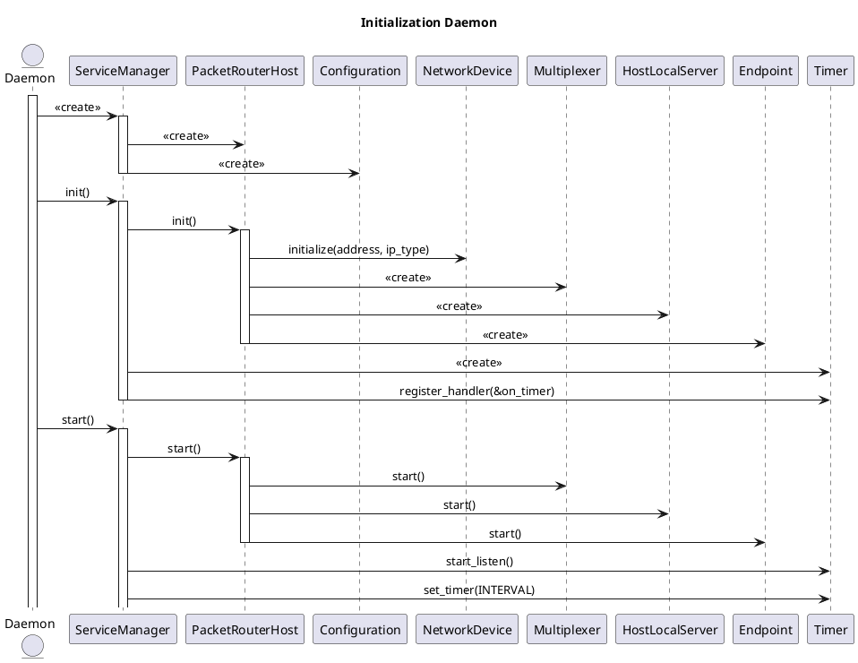
**Application**
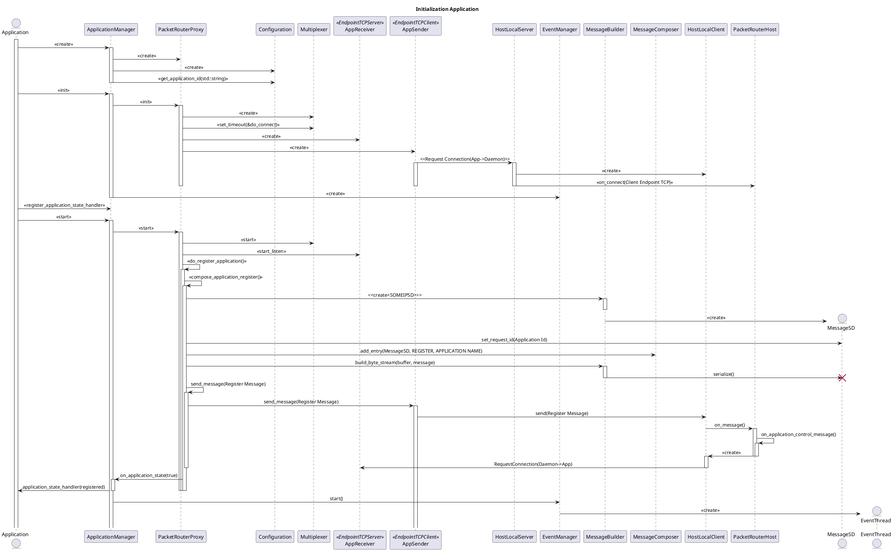
###### Control message for Service Discovery
###### OfferService - External
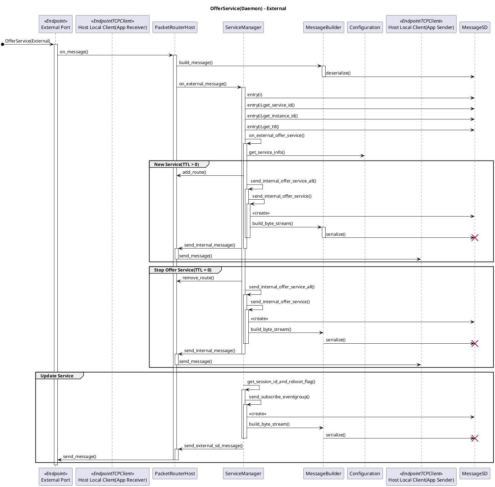
###### OfferService - Internal
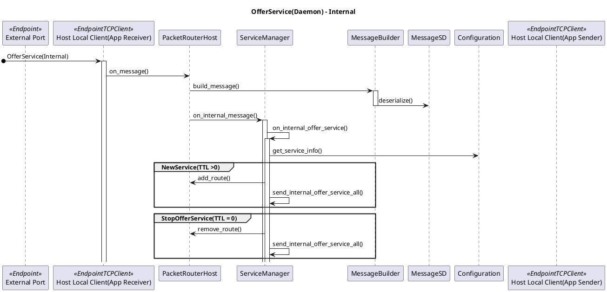
###### OfferService - Application

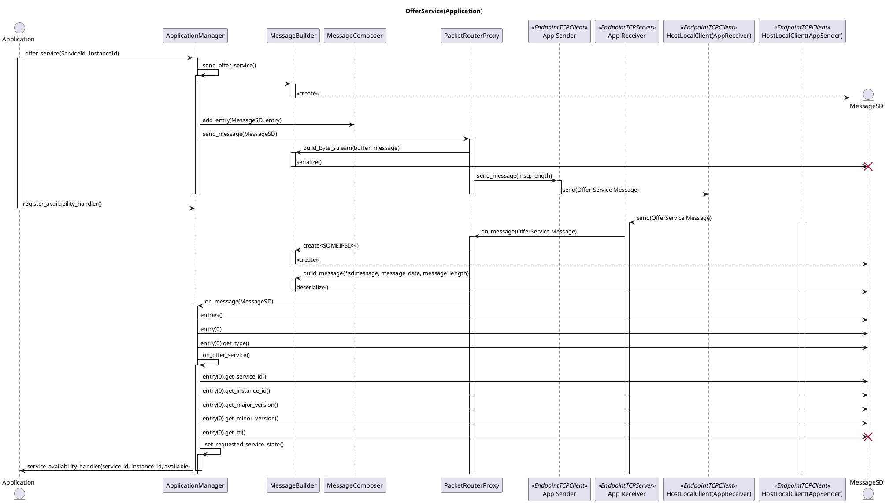

###### Subscribe - Daemon
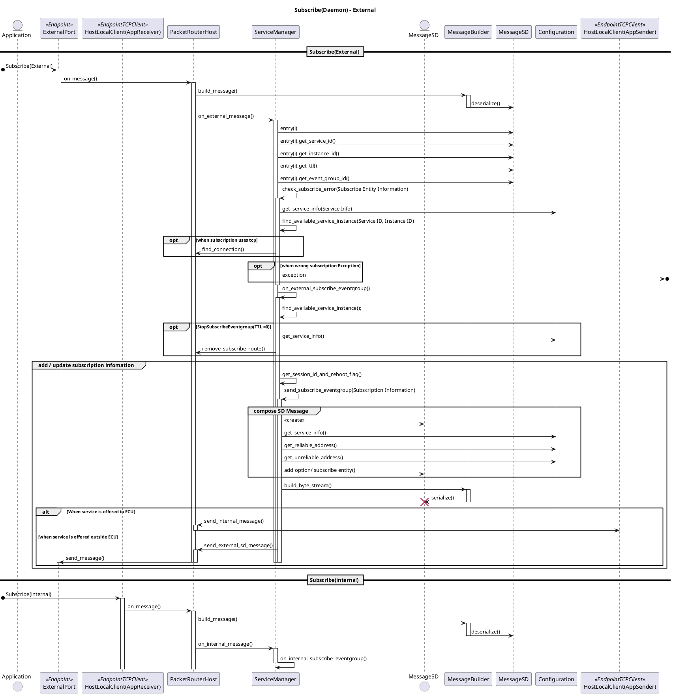

###### SubscribeAck - Daemon
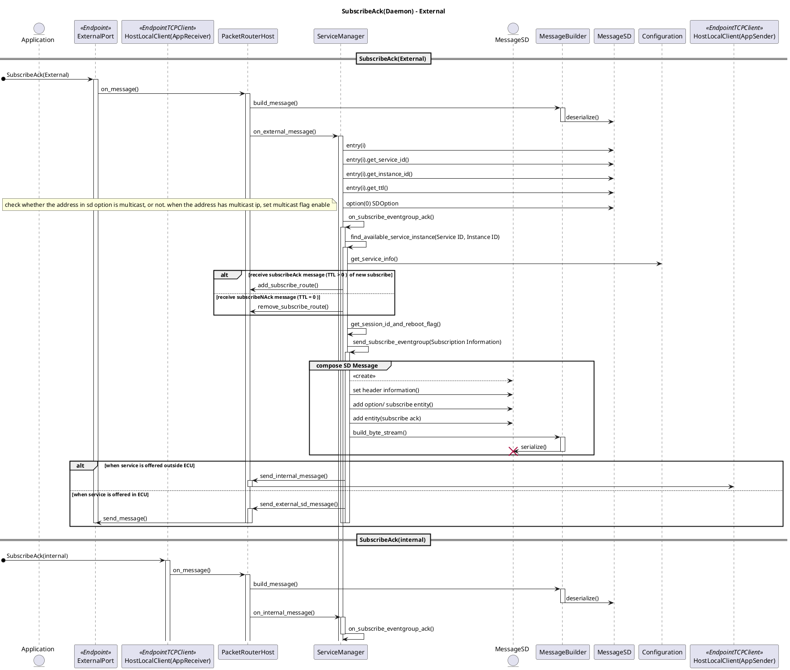

###### Request / Response
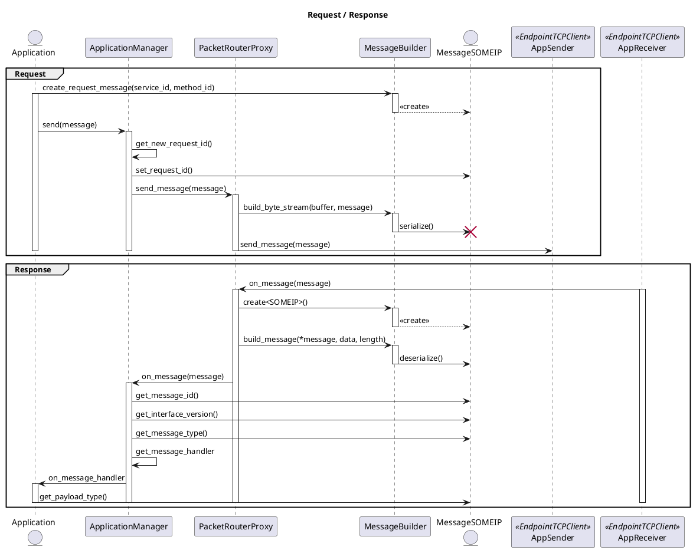

###### Event(Application)
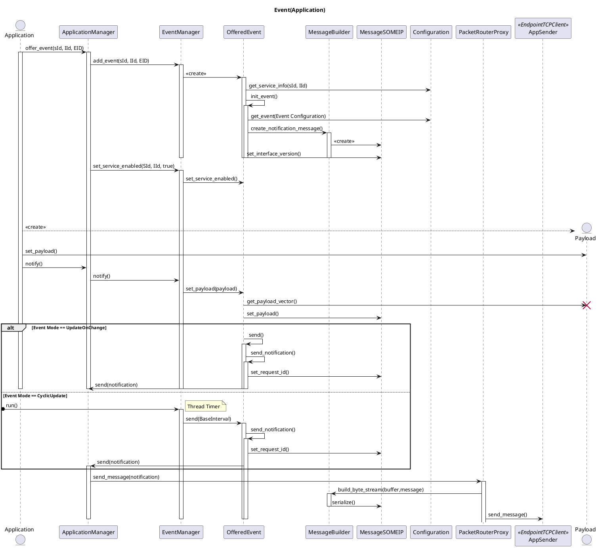

###### InternalMessage(Daemon)
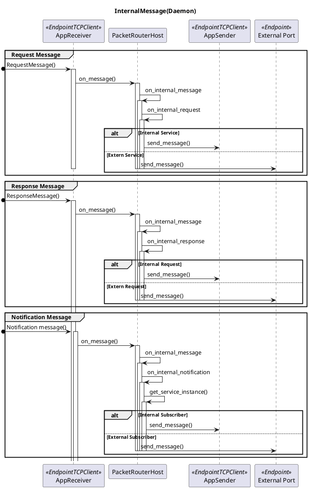

###### External Message(Daemon)
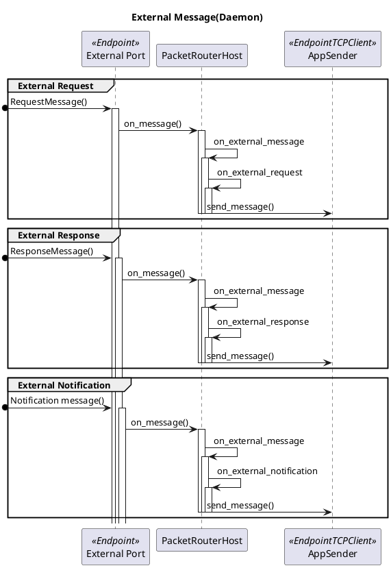